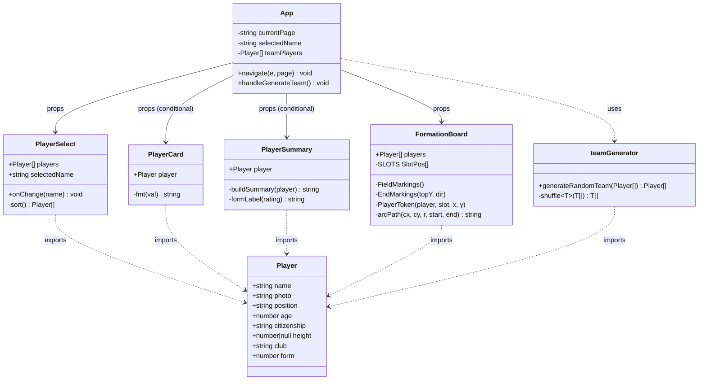
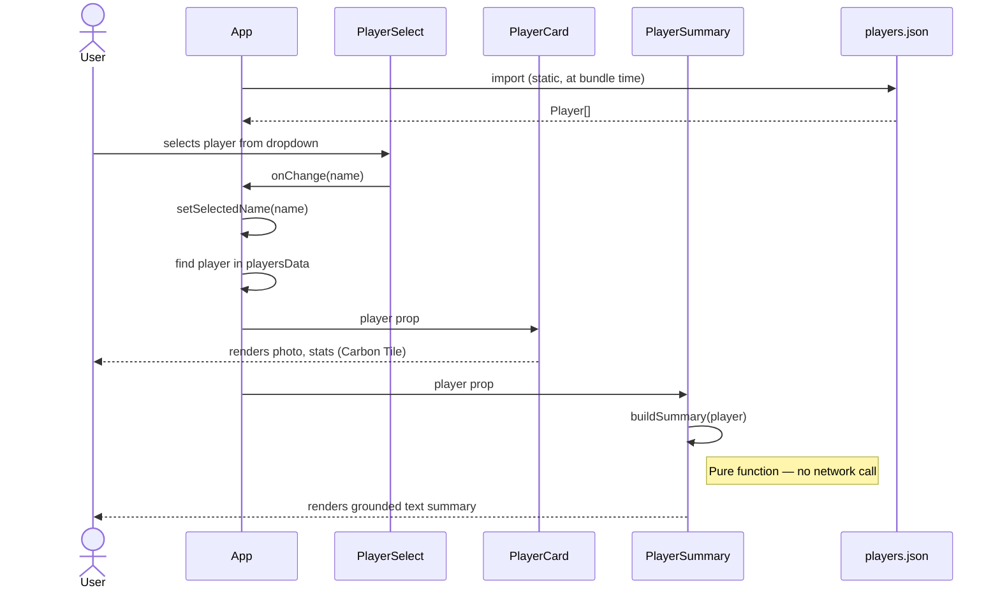
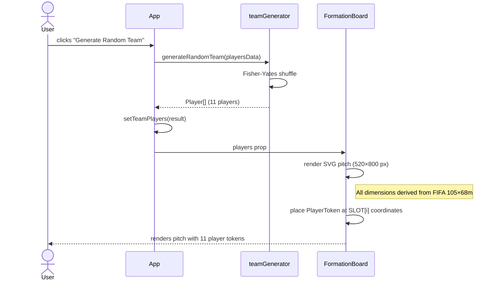
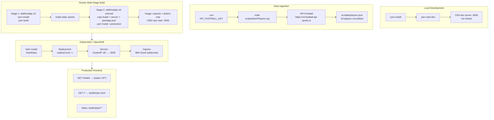

# Player Dashboard — Carbon React UI

<p align="left">
  
  
  
  
  
</p>

A Premier League player dashboard built on React 18, the IBM Carbon Design System, and an Express production server. The application provides two views — a **Player Browser** for querying individual player statistics and a **Team Formation Visualizer** displaying a FIFA-proportioned SVG pitch with 11 randomly selected players.

---

## Table of Contents

- [Tech Stack](#tech-stack)
- [Project Structure](#project-structure)
- [Architecture](#architecture)
  - [Component Class Diagram](#component-class-diagram)
  - [Data Flow Sequence — Player Browser](#data-flow-sequence--player-browser)
  - [Data Flow Sequence — Team Formation](#data-flow-sequence--team-formation)
  - [Build and Deployment Pipeline](#build-and-deployment-pipeline)
- [Getting Started](#getting-started)
- [Environment Variables](#environment-variables)
- [Data Ingestion Script](#data-ingestion-script)
- [Testing](#testing)
- [Production Deployment](#production-deployment)
  - [Docker](#docker)
  - [Kubernetes / OpenShift (Helm)](#kubernetes--openshift-helm)
- [Design Decisions and Gotchas](#design-decisions-and-gotchas)
- [License](#license)

---

## Tech Stack

| Layer | Technology | Version |
|---|---|---|
| UI framework | React | 18.2 |
| Language | TypeScript (components), JavaScript (App entry) | 5.x |
| Design system | IBM Carbon `@carbon/react` | 1.8 (v11) |
| Build tool | Create React App (`react-scripts`) | 5.0.1 |
| Styling | Sass (Dart Sass, `@use` module system) | 1.x |
| Server-side state | TanStack Query | 4.x |
| Production server | Express | 4.18 |
| Package manager | Yarn | 1.22 |
| Test runner | Jest + React Testing Library | CRA defaults |
| Container base | Red Hat UBI8 Node.js 16 | — |
| Orchestration | Helm chart (`chart/base/`) | 1.0.0 |

---

## Project Structure

```
.
├── chart/base/                  # Helm chart for Kubernetes/OpenShift deployment
│   └── templates/               # Deployment, Service, Ingress, Route manifests
├── public/                      # CRA static assets (tab-illo.png, etc.)
├── scripts/
│   └── fetchPlayers.mjs         # One-off data ingestion script (ESM, requires .env)
├── server/
│   └── server.js                # Express production server — serves build/ + /health
├── src/
│   ├── App.jsx                  # Root component; Carbon Header + page state machine
│   ├── App.scss                 # Page-level BEM layout classes
│   ├── App.test.js              # Integration tests (RTL + userEvent)
│   ├── index.js                 # React entry; mounts QueryClientProvider
│   ├── index.scss               # Global Carbon styles (@use '@carbon/react')
│   ├── components/
│   │   ├── FormationBoard/
│   │   │   └── FormationBoard.tsx   # FIFA-proportioned SVG pitch (520×800 px)
│   │   ├── PlayerCard/
│   │   │   ├── PlayerCard.tsx       # Carbon Tile with player stats
│   │   │   └── _player-card.scss
│   │   ├── PlayerSelect/
│   │   │   └── PlayerSelect.tsx     # Dropdown + canonical Player interface export
│   │   └── PlayerSummary/
│   │       ├── PlayerSummary.tsx    # Dataset-only grounded text summary
│   │       └── _player-summary.scss
│   ├── data/
│   │   └── players.json         # 53 PL players (2023 season); committed static asset
│   └── utils/
│       └── teamGenerator.ts     # generateRandomTeam() — Fisher-Yates shuffle
├── .env                         # API_FOOTBALL_KEY (not committed)
├── Dockerfile                   # Multi-stage build (builder → minimal runtime)
└── package.json
```

---

## Architecture

### Component Class Diagram



### Data Flow Sequence — Player Browser



### Data Flow Sequence — Team Formation



### Build and Deployment Pipeline



---

## Getting Started

**Prerequisites:** Node.js 18+, Yarn 1.x

```bash
# Install dependencies
yarn install

# Start development server (hot reload on :3000)
yarn start:dev
```

---

## Environment Variables

Create a `.env` file in the project root (already in `.gitignore`):

```dotenv
# Required only to re-run the data ingestion script
API_FOOTBALL_KEY=your_api_key_here
```

The application reads `players.json` from the committed static file at build time — the API key is **not** needed to run the app. It is only needed to re-fetch player data.

---

## Data Ingestion Script

`scripts/fetchPlayers.mjs` fetches Premier League player data from [API-Football](https://www.api-football.com/) and writes `src/data/players.json`.

```bash
node scripts/fetchPlayers.mjs
```

**Design decisions:**
- Queries by **team ID** (not league ID) with **season 2023** — the only combination that returns players with complete `games.rating` values on the free plan.
- Applies a 600 ms delay between API requests to stay within the free-plan rate limit.
- Filters to players with Premier League (`league.id === 39`) statistics only, deduplicates by name, and stores 53 players.
- Uses the `.mjs` extension because `package.json` has no `"type": "module"` (required to avoid breaking CRA's Jest CommonJS transform).

---

## Testing

```bash
# Run all tests (non-interactive)
CI=true yarn test

# Run tests matching a file name pattern
CI=true yarn test -- --testPathPattern=App

# Run a single test by name
CI=true yarn test -- --testNamePattern="switches to the formation page"
```

Tests live alongside source files. Carbon components require a `window.matchMedia` mock in `beforeEach` — the canonical mock is in [`src/App.test.js`](src/App.test.js).

---

## Production Deployment

### Docker

```bash
# Build image
docker build -t player-dashboard:latest .

# Run
docker run -p 3000:3000 player-dashboard:latest
```

The multi-stage Dockerfile:
1. **Builder stage** (`ubi8/nodejs-16`) — installs all dependencies and runs `yarn build`
2. **Runtime stage** (`ubi8/nodejs-16-minimal`) — copies only `build/`, `server/`, and runs `yarn install --production`

The runtime image contains only `express` and `dotenv`. All React, Carbon, and TypeScript packages are build-time only.

The Express server exposes:

| Endpoint | Description |
|---|---|
| `GET /health` | Returns `{"status":"UP"}` — used as liveness/readiness probe |
| `GET /static/**` | Serves CRA-built static assets from `build/` |
| `GET /*` | Returns `build/index.html` (SPA catch-all) |

The server port defaults to `3000` and is overridden with the `PORT` environment variable.

### Kubernetes / OpenShift (Helm)

The Helm chart in `chart/base/` targets IBM Cloud Kubernetes Service and OpenShift.

```bash
helm install player-dashboard ./chart/base \
  --set image.repository=<registry>/<image> \
  --set image.tag=<tag> \
  --set vcsInfo.repoUrl=<repo-url> \
  --set vcsInfo.branch=main
```

Key `values.yaml` defaults:

| Value | Default | Description |
|---|---|---|
| `replicaCount` | `1` | Pod replicas |
| `image.port` | `3000` | Container port |
| `service.type` | `ClusterIP` | Kubernetes service type |
| `service.port` | `80` | Service port (maps to `3000`) |
| `ingress.enabled` | `true` | Creates an Ingress resource |
| `ingress.subdomain` | `containers.appdomain.cloud` | IBM Cloud default subdomain |
| `route.enabled` | `false` | OpenShift Route (enable for OCP) |

For OpenShift pipelines using the IBM Garage Cloud-Native Toolkit:

```bash
npm install -g @ibmgaragecloud/cloud-native-toolkit-cli
oc sync <project> --tekton
oc pipeline
```

---

## Design Decisions and Gotchas

| Decision | Rationale |
|---|---|
| **No client-side router** | Navigation is a `currentPage` state machine in `App.jsx`. Only one page is in the DOM at a time. `HeaderMenuItem` uses `e.preventDefault()` to suppress the `href="#"` jump. |
| **`Player` interface in `PlayerSelect.tsx`** | Single canonical source; all other files import from there. Prevents drift between the API shape and component props. |
| **TypeScript components use `.tsx`; `App.jsx` stays `.js`** | CRA's Babel does not strip TypeScript type syntax from `.jsx` files — it emits it verbatim, causing `ReferenceError` at runtime. Typed code lives in `.tsx` files only. |
| **Explicit `.tsx` extension in imports from `.jsx`** | Without a `tsconfig.json`, CRA's Webpack resolver does not auto-resolve `.tsx` from a `.jsx` importer. |
| **TypeScript pinned to `^5.x`** | `react-scripts@5` bundles `@typescript-eslint/parser@5.30.5`, which breaks on the TypeScript 6 compiler API. |
| **`FormationBoard` uses `overflow: visible`** | Goal rectangles protrude 14 px outside `FIELD_H`. The outer wrapper adds `padding: 14px 0` to absorb overflow without clipping page layout. |
| **All pitch dimensions derived from FIFA 105×68m** | Constants at the top of `FormationBoard.tsx` compute every measurement proportionally from `IW`/`IH`. Do not hardcode pixel values for new markings. |
| **`players.json` committed to source** | The free API-Football plan has strict rate limits. Committing the static file means the app works without an API key. Re-run `fetchPlayers.mjs` to refresh data. |
| **`react` and Carbon in `devDependencies`** | The Docker runtime stage runs `yarn install --production` and only installs `express` + `dotenv`. React and Carbon are bundled into `build/` by CRA and not needed at runtime. |

---

## License

Licensed under the [Apache License, Version 2.0](https://www.apache.org/licenses/LICENSE-2.0.txt).

Third-party code is subject to its own respective licenses. Contributions are subject to the [Developer Certificate of Origin, Version 1.1](https://developercertificate.org/).
